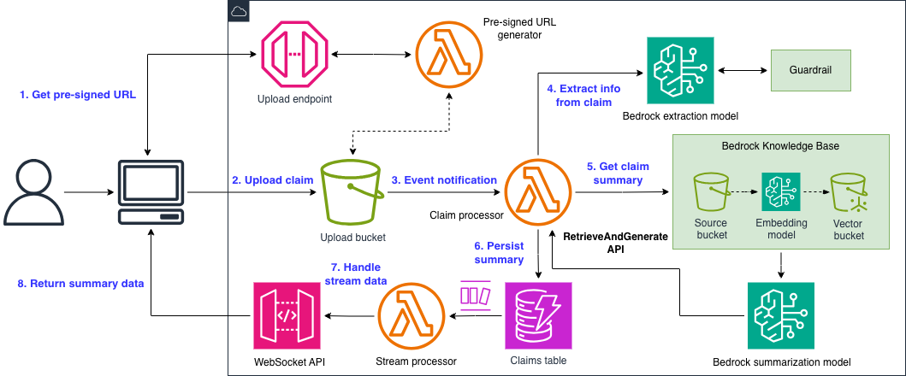

# AIP-C01 Task 1.1 - Insurance claims

This project is an implementation of the Skill Builder exam preparation learning path bonus assignment for Task 1.1.

Code and architecture patterns are based on AWS training materials.

## Pre-requisites

Node.js v24 and `npm` installed.

## Before you deploy it

I deployed the stack to `eu-central-1`, so the model ID and inference profile ID reflect that region. If you want to use a different region or model, modify the `modelId` and `inferenceProfileId` constants in `lib/insurance-claims-stack.ts`.

## Architecture

## Infrastructure deployment

The resources can be deployed as follows:

* `cd` to the project folder.
* Run `npm install`.
* Run `npx cdk deploy`.
* Add a sample insurance policy document to the knowledge base's source bucket (`insuranceclaimsstack-claimsknowledgebasesource...`). Refer to the `sample-data` folder for an example.

## Run the app

* Navigate to the `frontend` folder: `cd frontend`.
* Create a file called `.env` in the folder. Copy the REST and WebSocket API invoke URLs. Replace the placeholders with the actual values for the `VITE_CLAIMS_API_URL` and `VITE_CLAIMS_WS_URL` environment variables, respectively. See `.env.example` for reference.
* Run `npm install`.
* Run `npm run dev`.

The server starts running on `http://localhost:5173`.

Upload a claim. The app works with `.txt` files (see the `sample-data` folder for an example claim).

## Limitations

The app is **NOT** production ready and is not intented to be so. It's missing many key elements necessary for production environments, like input verification, websocket connection, API protection, and many more.

The purpose of this mini-project is to make the entire flow work.
